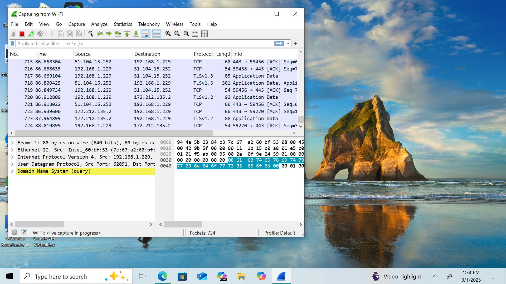
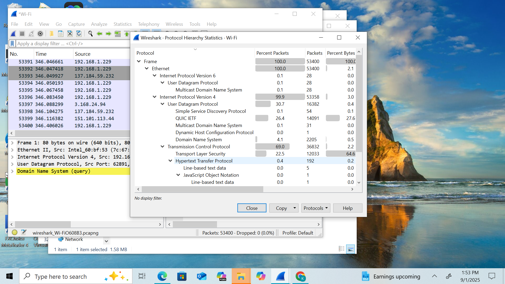
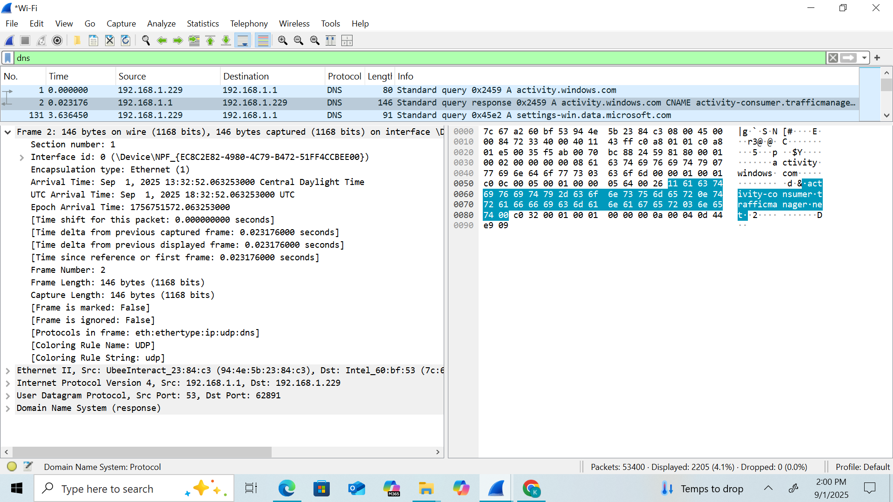
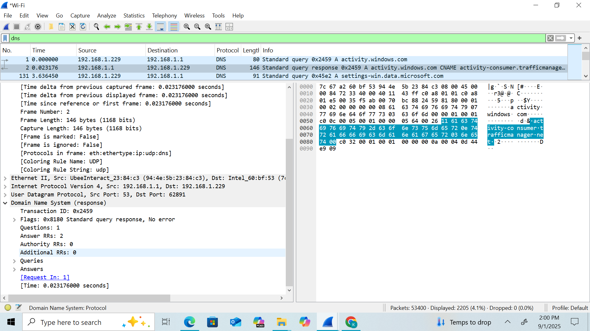
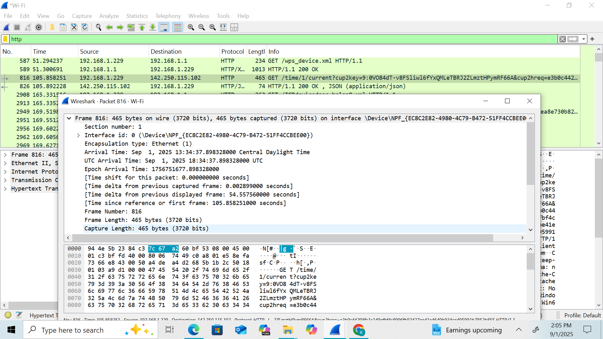
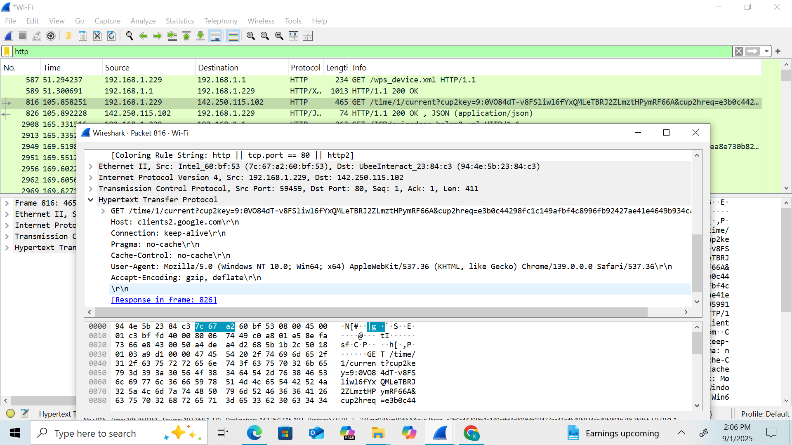
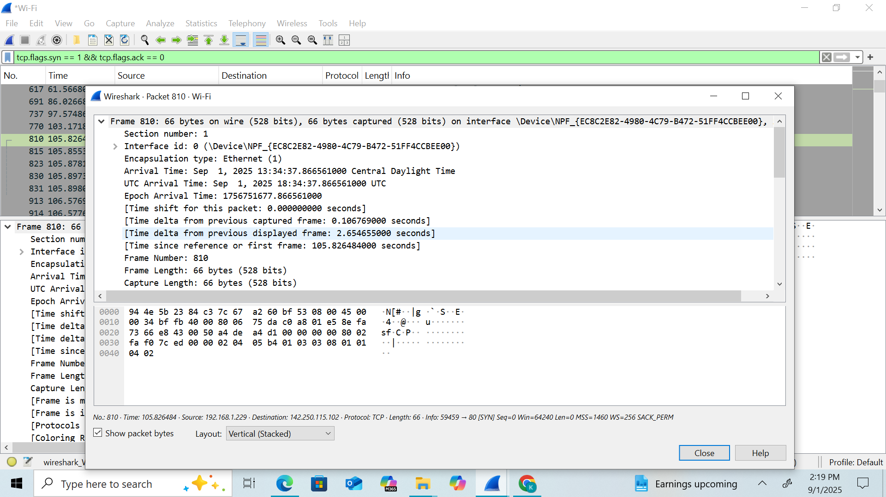
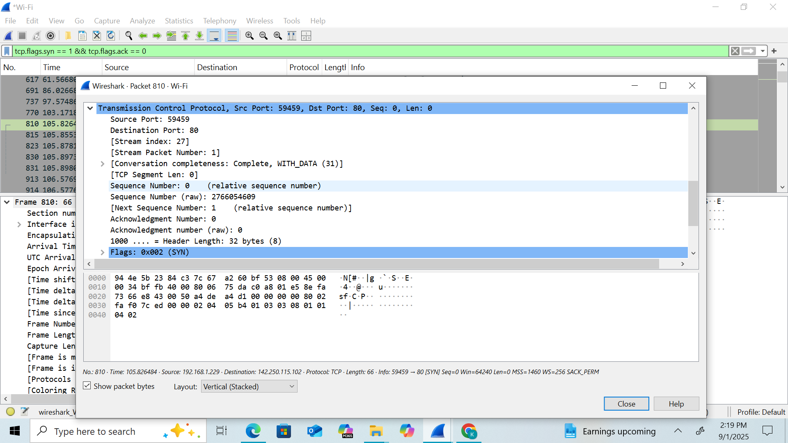
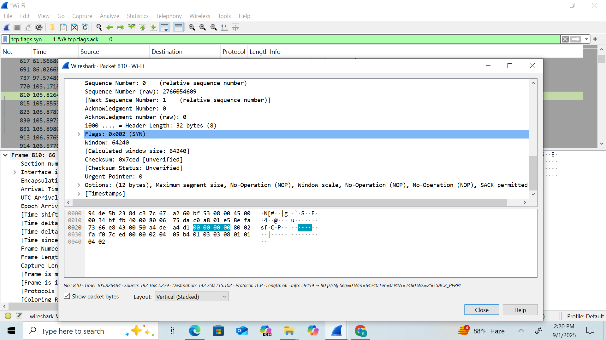

## Project Objective
Capture, filter, and analyze network traffic using Wireshark.  
Demonstrates understanding of protocols, packet structure, and network communication.

## Tools Used
- Wireshark (latest version)  
- Computer with active network connection (Wi-Fi/Ethernet)  

## Step-by-Step Process

### Step 1: Start Capture
1. Open Wireshark and select the active network interface.  
2. Leave the capture filter blank to record all traffic.  
3. Browse some websites to generate traffic.  

### Step 2: Protocol Hierarchy
1. Analyze traffic breakdown: `Statistics -> Protocol Hierarchy`.  
2. Note common protocols (TCP, UDP, HTTP, DNS, HTTPS).  

### Step 3: DNS Packet Analysis
1. Apply display filter: `dns`  
2. Inspect DNS query packets.  
3. Expand Frame and DNS sections.  

  

### Step 4: HTTP Packet Analysis
1. Apply display filter: `http` (or `tcp.port == 443` for HTTPS)  
2. Inspect HTTP GET/POST requests.  
3. Expand Frame and HTTP sections.  

  

### Step 5: TCP Handshake
1. Apply display filter: `tcp.flags.syn == 1 && tcp.flags.ack == 0`  
2. Inspect the initial SYN packet of a TCP handshake.  
3. Expand Frame and TCP sections.  

  
  

## Key Findings
- Most traffic was over TCP and HTTPS.  
- DNS queries revealed the domains visited during the capture.  
- HTTP traffic is readable; HTTPS is encrypted.  
- TCP handshake shows the 3-way connection setup process.

## Reflection
This project taught me how to:  
- Capture and analyze network traffic  
- Filter specific protocols (DNS, HTTP, TCP)  
- Interpret packet metadata (Frame, Protocol, Bytes)  
- Identify encrypted vs unencrypted communication  
- Gain a deeper understanding of Wireshark and how to use it effectively
